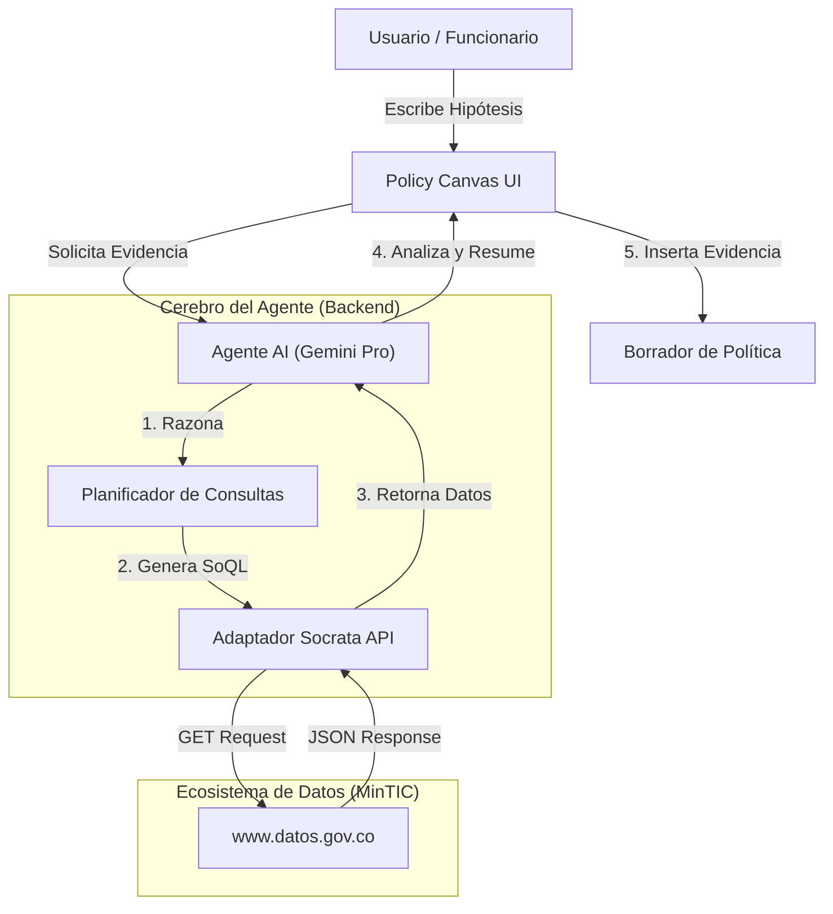

# Cuestión de Datos: Policy Canvas 🇨🇴
> **Plataforma de Inteligencia Artificial para el Diseño de Políticas Públicas Basadas en Evidencia**
> *Proyecto participante en el concurso "Datos al Ecosistema 2025" - MinTIC Colombia*


[](https://cuestiondedatos.com/)

## 1. Descripción del Problema 🎯

En Colombia, la formulación de políticas públicas sociales enfrenta un desafío crítico: la **fragmentación de la información**. Aunque existen datos abiertos valiosos en entidades como el DNP, DPS, MinSalud y MinEducación, estos se encuentran dispersos en silos.

Esto provoca:
*   Diagnósticos incompletos y reactivos.
*   Baja precisión en la focalización de recursos.
*   Dificultad para que la ciudadanía ejerza control social.
*   Decisiones basadas en intuición o inercia institucional, en lugar de evidencia datos.

**El Reto:** ¿Cómo transformar millones de filas de datos abiertos dispersos en *insights* accionables para un funcionario público que necesita diseñar una intervención social efectiva?

---

## 2. Solución Tecnológica: ActRAG 🤖

**Cuestión de Datos** no es solo un chatbot. Es un **Policy Canvas Interactivo** potenciado por una arquitectura de IA **ActRAG (Active Retrieval-Augmented Generation)**.

A diferencia de un LLM tradicional que alucina datos, nuestro sistema actúa como un **Agente Explorador**:
1.  **Entiende** el contexto de la política pública que el usuario está redactando.
2.  **Navega autónomamente** por los metadatos reales de `www.datos.gov.co`.
3.  **Consulta** las APIs oficiales (Socrata/SODA) en tiempo real.
4.  **Recupera** evidencia estadística precisa (tablas, cifras, indicadores).
5.  **Integra** esa evidencia directamente en el borrador del documento.

### Datasets Estratégicos Integrados 📊
El sistema tiene acceso directo a fuentes de la **Hoja de Ruta Nacional de Datos**:
*   🌍 **APC Colombia:** Recursos de Cooperación Internacional.
*   🏛️ **Congreso:** Registro de proyectos gubernamentales.
*   🏥 **MinSalud:** Indicadores de calidad y cobertura (EPS/IPS).
*   🎓 **MinEducación:** Educación para el Trabajo y Desarrollo Humano.
*   🏠 **DNP:** Beneficiarios del Sisbén (Focalización).

---

## 3. Arquitectura del Sistema 🏗️

El proyecto sigue una arquitectura moderna **ReAct (Reason + Act)** implementada sobre Next.js.



### Componentes Clave:
*   **Frontend:** Next.js + TailwindCSS + Framer Motion (Experiencia de usuario fluida).
*   **Editor:** Tiptap (Editor de texto enriquecido para la redacción).
*   **IA Core:** Google Gemini Pro (Modelo de razonamiento).
*   **Data Layer:** Socrata SODA API (Conexión directa a fuentes oficiales).
*   **Onboarding:** React Joyride (Guía interactiva para nuevos usuarios).

---

## 4. Estructura del Proyecto 📂

```bash
/
├── components/
│   ├── canvas/          # El núcleo: Editor de políticas y tarjetas de sección
│   ├── copilot/         # El Agente: Chat lateral y visualización de datos
│   ├── wizard/          # Pasos de configuración inicial (Onboarding)
│   └── common/          # Componentes UI reutilizables
├── pages/
│   ├── api/
│   │   └── consultar.js # ⚙️ Endpoint Serverless: Orquesta la IA y las APIs
│   └── index.js         # Punto de entrada de la aplicación
├── utils/
│   └── systemPrompt.js  # 🧠 Cerebro: Esquemas de metadatos y reglas SoQL
├── generar_cerebro.js   # Script de mantenimiento para actualizar metadatos
└── public/              # Assets estáticos
```

---

## 5. Instrucciones de Instalación Local 💻

Para ejecutar este proyecto en tu máquina local:

### Prerrequisitos
*   Node.js 18+ instalado.
*   Una API Key de **Google Gemini** (AI Studio).
*   (Opcional pero recomendado) Un App Token de **Socrata** (Datos.gov.co).

### Pasos
1.  **Clonar el repositorio:**
    ```bash
    git clone https://github.com/Grajales-Camilo/cuestion-de-datos-MinTIC-2025.git
    cd cuestion-de-datos
    ```

2.  **Instalar dependencias:**
    ```bash
    npm install
    ```

3.  **Configurar variables de entorno:**
    Crea un archivo `.env.local` en la raíz y añade tus claves:
    ```env
    GEMINI_API_KEY=tu_clave_aqui
    SOCRATA_APP_TOKEN=tu_token_aqui
    ```

4.  **Ejecutar el servidor de desarrollo:**
    ```bash
    npm run dev
    ```

5.  **Abrir en el navegador:**
    Visita `http://localhost:3000`.

---

## 6. Equipo DG Capital 🚀
*   **Juan Camilo Grajales:** Líder de Proyecto y Análisis de datos.
*   **Sofia Grajales :** Desarrollo y Estadística.
*   **Duván Grajales** Administración y Recursos.
*   **Para este pproyecto usamos Google Antigravity (con Gemini 3):** Como agente de programación y arquitectura.

> *Queremos transformar la forma de usar y analizar datos para tomar mejores decisiones.*
