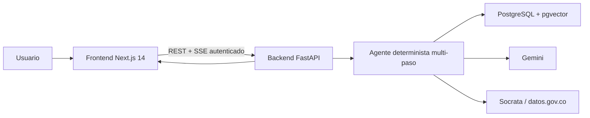

# Cuestión de Datos v2

**Asistente para investigar datos abiertos colombianos e incorporar evidencia trazable en documentos de política pública.**

[](https://github.com/Grajales-Camilo/cuestion-de-datos-MinTIC-2026/actions/workflows/ci.yml)
[](https://preview.cuestiondedatos.com/)

> La rama predeterminada y de integración es `v2`. El Preview es un entorno de staging con preguntas sintéticas; no constituye promoción ni certificación de producción.

## Qué hace

Cuestión de Datos permite que una persona sin conocimientos de programación:

1. formule una pregunta o investigue una sección de su documento;
2. observe en tiempo real los pasos verificables del agente;
3. consulte evidencia procedente de datos.gov.co mediante Socrata;
4. revise calidad, fuente, consulta y limitaciones;
5. inserte evidencia con cita trazable en el documento;
6. guarde el trabajo localmente, importe DOCX y exporte a Word.

La regla principal del proyecto es sencilla: **evidencia verificable o nada**. Las cifras no pueden provenir del conocimiento paramétrico del modelo; deben estar respaldadas por consultas reales y claims reproducibles.

## Arquitectura v2


```mermaid
flowchart LR
    U["Usuario"] --> F["Frontend Next.js 14"]
    F -->|"REST + SSE autenticado"| B["Backend FastAPI"]
    B --> A["Agente determinista multi-paso"]
    A --> P["PostgreSQL + pgvector"]
    A --> G["Gemini"]
    A --> S["Socrata / datos.gov.co"]
    B --> F
```

- **Frontend:** Next.js 14, React 18, Tailwind CSS, Tiptap y Pages Router.
- **Backend:** FastAPI, Python, LangGraph y runtime determinista.
- **Persistencia:** PostgreSQL 16 con `pgvector` y `pg_trgm`.
- **Datos:** catálogo de datos.gov.co y consultas SODA/SoQL de solo lectura.
- **IA:** Gemini configurable desde el backend; ninguna clave de proveedor llega al navegador.
- **Observabilidad:** corridas, pasos, eventos, evidencias, latencias, tokens y errores persistidos.

El navegador consume directamente `/v2/*` mediante `NEXT_PUBLIC_BACKEND_URL`. No existe un proxy de agente dentro de Next.js ni un fallback al frontend v1.

## Rutas publicadas en staging

- Portada: [preview.cuestiondedatos.com](https://preview.cuestiondedatos.com/)
- Aplicación: [preview.cuestiondedatos.com/app](https://preview.cuestiondedatos.com/app)
- Backend de staging: [cdd-preview01-stg-api.onrender.com/v2/health](https://cdd-preview01-stg-api.onrender.com/v2/health)

El dominio productivo y sus métricas se gestionan por separado. Las corridas de PREVIEW-01 no cuentan como tráfico real ni sustituyen las puertas T-617/T-701/T-702/T-703.

## Estructura del repositorio

```text
backend/    API, agente, evaluación y pruebas
db/         inicialización y extensiones PostgreSQL
frontend/   aplicación web v2
specs/      requisitos, contratos, modelo y plan de pruebas
docs/       arquitectura, decisiones y evidencia de release
.github/    integración continua
```

La fuente normativa empieza en [`specs/constitution.md`](specs/constitution.md). El orden de lectura completo está en [`AGENTS.md`](AGENTS.md) y [`specs/README.md`](specs/README.md).

## Ejecución local

### Requisitos

- Windows 11 y PowerShell 7, o un entorno equivalente.
- Docker Desktop para PostgreSQL local.
- Python compatible con `backend/pyproject.toml` y `uv`.
- Node.js 20 o superior y npm.
- Claves propias de los proveedores configuradas únicamente en archivos `.env` no versionados.

### Base de datos

```powershell
docker compose up -d db
docker compose ps
```

### Backend

```powershell
Set-Location backend
uv sync --frozen --no-dev
uv run alembic upgrade head
uv run python -m uvicorn app.main:app --host 127.0.0.1 --port 8000
```

### Frontend

```powershell
Set-Location frontend
npm ci
Copy-Item .env.local.example .env.local
npm run dev
```

Configura en `frontend/.env.local`:

```dotenv
NEXT_PUBLIC_BACKEND_URL=http://localhost:8000
```

Las instrucciones completas están en [`specs/001-cuestion-de-datos-v2/quickstart.md`](specs/001-cuestion-de-datos-v2/quickstart.md) y [`frontend/README.md`](frontend/README.md).

## Verificación

```powershell
Set-Location frontend
npm run lint
npm run test
npm run build
npm run audit:bundle
```

El workflow [`.github/workflows/ci.yml`](.github/workflows/ci.yml) valida backend y frontend en cada PR. Las evaluaciones reales con Gemini y Socrata tienen puertas y presupuestos separados; no deben ejecutarse como una suite común de desarrollo.

## Seguridad y privacidad

- No se versionan secretos ni archivos `.env` reales.
- El frontend nunca recibe claves de Gemini, Socrata o PostgreSQL.
- Cada corrida usa un token de acceso de alcance mínimo enviado por `Authorization: Bearer`.
- Los documentos permanecen en el navegador; importación y exportación DOCX se ejecutan localmente.
- Las consultas SoQL son de solo lectura y pasan validación antes de ejecutarse.
- Las corridas pueden borrarse de forma irreversible desde la aplicación.

## Estado

La interfaz v2 y el staging diagnóstico están operativos. La certificación y promoción a producción siguen sujetas a las tareas y puertas abiertas documentadas en [`specs/001-cuestion-de-datos-v2/tasks.md`](specs/001-cuestion-de-datos-v2/tasks.md).

Consulta [`CHANGELOG.md`](CHANGELOG.md) para el resumen de la versión y [`docs/frontend-v2/README.md`](docs/frontend-v2/README.md) para la documentación técnica del frontend.

## Licencia

MIT.
